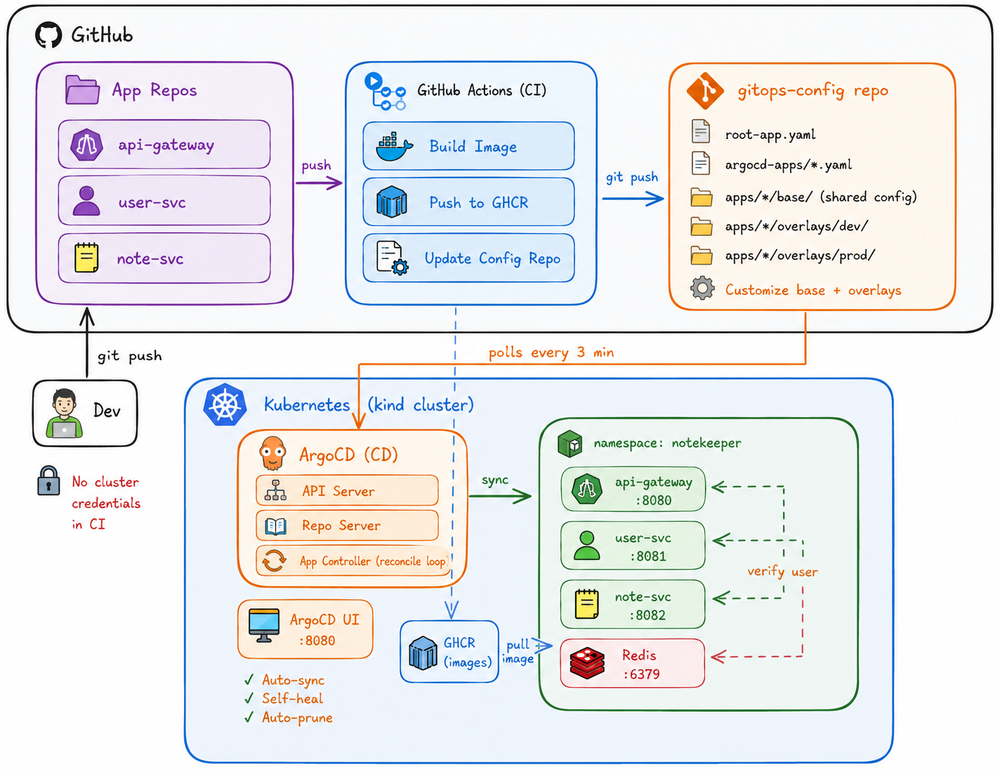

# GitOps Microservices Platform — NoteKeeper

This repository contains a production-grade GitOps deployment platform for a microservices note-taking API, built with ArgoCD, Kustomize, and GitHub Actions.

## Architecture



## Repository Structure

This is a monorepo containing the following main components:

-   `api-gateway/`, `user-svc/`, `note-svc/`: Go-based microservices.
-   `gitops-config/`: Kubernetes manifests and ArgoCD configuration for GitOps.
-   `docker-compose.yaml`: For local development and testing.
-   `kind-config.yaml`: Configuration for a local Kubernetes cluster using KIND.

For more details on the GitOps setup, see the [gitops-config/README.md](gitops-config/README.md).

## Quick Start

To get the full application running on a local Kubernetes cluster:

```bash
# 1. Create a local Kubernetes cluster with Kind
kind create cluster --config kind-config.yaml

# 2. Install ArgoCD
kubectl create namespace argocd
kubectl apply -n argocd -f https://raw.githubusercontent.com/argoproj/argo-cd/stable/manifests/install.yaml

# 3. Apply the root application
kubectl apply -f gitops-config/root-app.yaml
```

